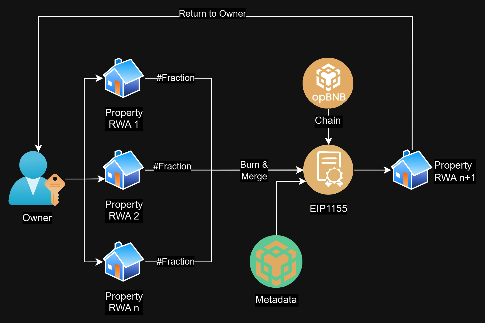

# Chain-Estate
A platform where you can sell, buy and merge tokenized Real Estate assets.

# Solution:

We created a marketplace type platform for NFTs, however, far from that, our platform provides the ability to generate RWA Tokenization by being able to perform fractions and merges.

# Diagrams:

Here we show the general diagrams of the solution.

## Mint:

The Mint and Retrieve process of token information depends mostly on [BNB Greenfield](https://greenfield.bnbchain.org/en), we consume this service through [Dcellar](https://dcellar.io/)

The great advantage of using this type of service combined with the contract of [ERC1155](./Contracts/Properties.sol) is that we can use the ID token as part of our file structure.

This is coordinated with the smart contract when retrieving the URI as requested by the standard.

    function uri(uint256 _tokenId)
        public
        view
        override
        returns (string memory)
    {
        return
            string(
                abi.encodePacked(
                    "https://greenfield-sp.defibit.io/view/chain-estate/properties/",
                    properties[_tokenId].tokenId.toString(),
                    "/metadata.json"
                )
            );
    }

The complete contract used is here in the repository.

[Contract](./Contracts/Properties.sol)

## Sell:

The sale of tokens is not something as trivial as a transfer of assets, in our contract each owner can decide how many tokens to sell to the public.

    function approveForSale(uint256 _propertyId, uint256 _fractionCount)
        public
        nonReentrant
    {
        require(balanceOf(msg.sender, _propertyId) > 0, "Insufficient balance");
        require(
            balanceOf(msg.sender, _propertyId) >= _fractionCount,
            "Not enough fractions to approve sale"
        );
        _updateSaleableFractions(msg.sender, _propertyId, _fractionCount);
    }

On our website you can find the code to perform this setup from the UI without having to access the smart contract directly.

And when making a sale, since we are very interested in the traceability of the purchase and sale of these assets and properties, we generate an event that generates information that will remain in the chain so that it can be reviewed at any time.

    // Events
    event PropertyMinted(uint256 indexed propertyId, address indexed minter);
    event FractionSold(
        uint256 indexed propertyId,
        address indexed seller,
        address indexed buyer,
        uint256 fractionAmount
    );

The complete contract used is here in the repository as well as the website.

[Contract](./Contracts/Properties.sol)
[WebDapp](./web-dapp/src/app/)

## Merge:

Finally, the merge, this is the process we created to combine several assets, whether whole or fractional, in order to generate a single asset, whether whole or fractional, that can represent a "reid".

    function mergeTokens(
        uint256[] memory _tokenIds,
        uint256[] memory _amounts,
        uint256 _fractionCount
    ) public nonReentrant {
        bool _continue = true;
        for (uint256 i = 0; i < _tokenIds.length; i++) {
            if (balanceOf(msg.sender, _tokenIds[i]) >= _amounts[i]) {
                continue;
            } else {
                _continue = false;
            }
        }
        // Check Balances
        require(_continue);
        uint256 value = 0;
        for (uint256 i = 0; i < _tokenIds.length; i++) {
            value += calculateCost(_tokenIds[i], _amounts[i]);
        }
        // Calculate the new Reid value 
        for (uint256 i = 0; i < _tokenIds.length; i++) {
            _burn(msg.sender, _tokenIds[i], _amounts[i]);
            Property storage temp = properties[_tokenIds[i]];
            _updateProperty(
                _tokenIds[i],
                temp.fractionAmount - _amounts[i],
                temp.pricePerFraction,
                temp.isPublic
            );
        }
        // Burn and update tokens registers
        properties[propertyCounter.current()] = Property({
            fractionAmount: _fractionCount,
            pricePerFraction: value / _fractionCount,
            isPublic: true,
            tokenId: propertyCounter.current()
        });
        // Update de Properties values for fractional
        owners[propertyCounter.current()] = [msg.sender];
        _updateSaleableFractions(msg.sender, propertyCounter.current(), 0);
        // Mint the new RWA
        _mint(msg.sender, propertyCounter.current(), _fractionCount, "");
        propertyCounter.increment();
        propertiesMinted = propertyCounter.current();
        emit PropertyMinted(propertyCounter.current() - 1, msg.sender);
    }

Although it may seem like a somewhat cumbersome process in the backend, our users only have to select the properties to combine, as well as the fractional amounts they want and merge them with just one button and a signature from their wallet.

