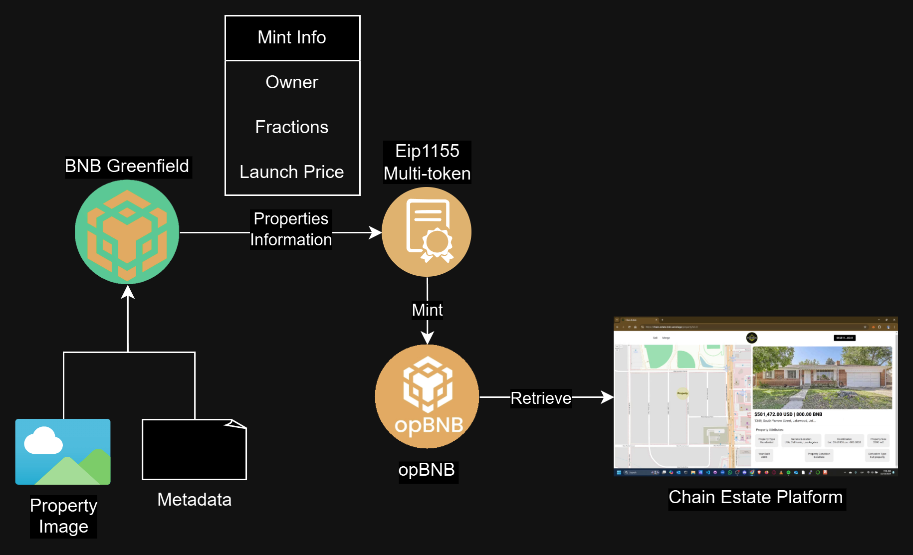
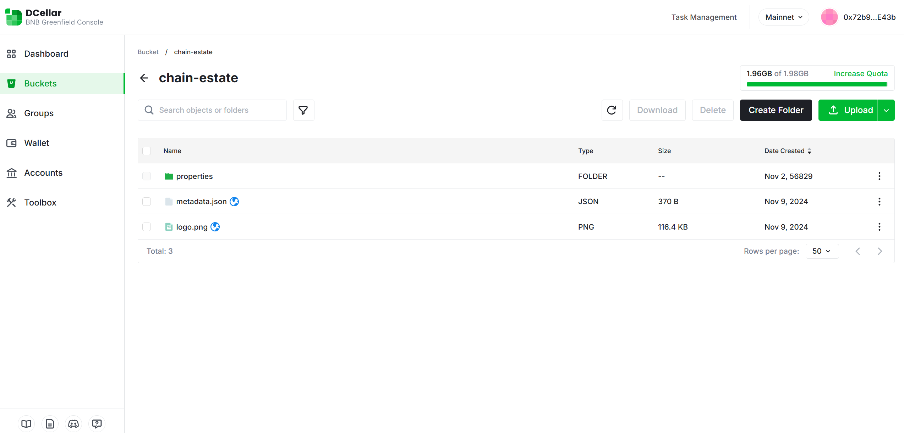
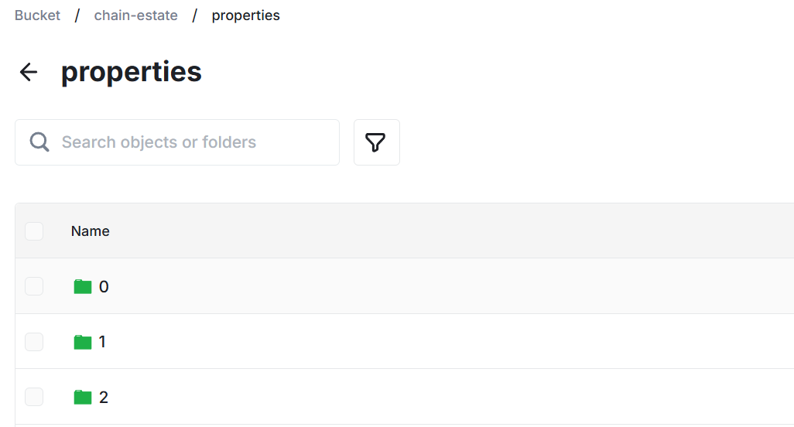
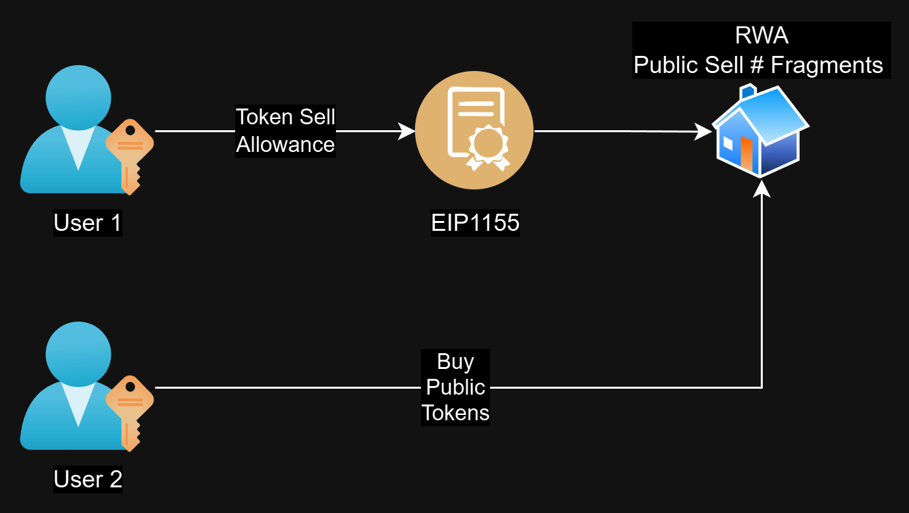
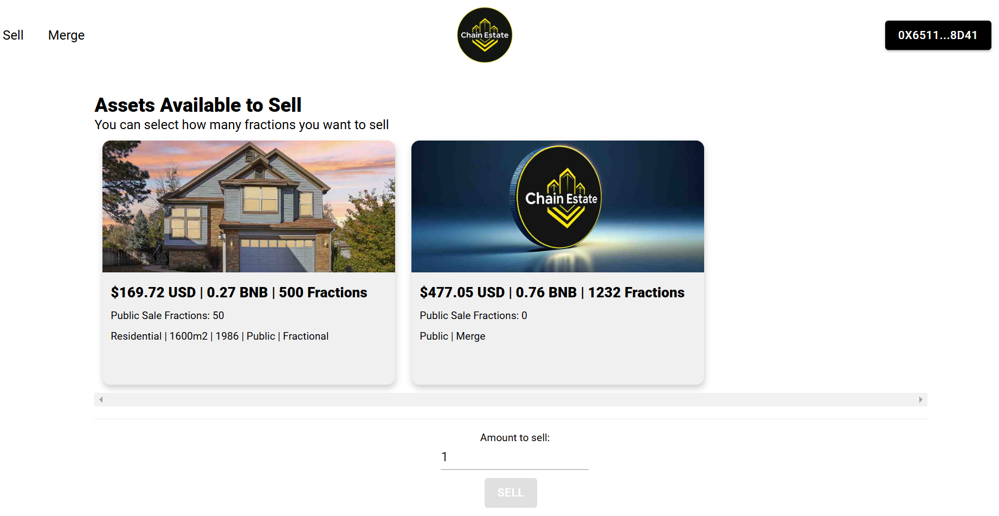
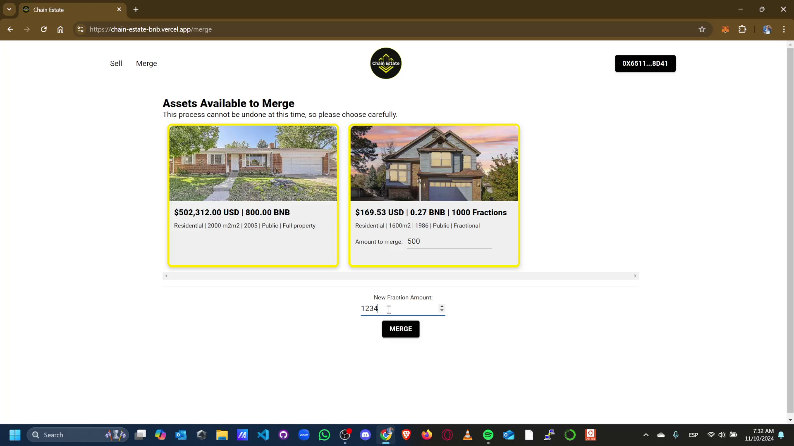

# Chain-Estate
A platform where you can sell, buy and merge tokenized Real Estate assets.

# Intro:

# Problem:

# Solution:

Creamos una plataforma tipo marketplace de NFTs, sin embargo muy lejos de eso, nuestra plataforma provee la capacidad de generar RWA Tokenization al poder realizar fractions y merges.

# Diagrams:

Aqui mostramos los diagramas generales de la solucion.

## Mint:

El proceso de Mint y Retrieve de la informacion de los tokens depende mayormente de [BNB Greenfield](https://greenfield.bnbchain.org/en), este servicio lo estamos consumiendo gracias a [Dcellar](https://dcellar.io/)

La gran ventaja de utilizar este tipo de servicio combinado con el contrato de [ERC1155](./Contracts/Properties.sol) es que podemos utilizar el token ID como parte de nuestra estructura de archivos.

Esto esta coordinado con el smart contract al hacer retrieve del URI como pide el standard.

    function uri(uint256 _tokenId)
        public
        view
        override
        returns (string memory)
    {
        return
            string(
                abi.encodePacked(
                    "https://greenfield-sp.defibit.io/view/chain-estate/properties/",
                    properties[_tokenId].tokenId.toString(),
                    "/metadata.json"
                )
            );
    }

El contrato completo que se utilizo esta aqui en el repositorio.

[Contract](./Contracts/Properties.sol)

## Sell:

La venta de los tokens no es algo tan trivial como una transferencia de assets, en nuestro contrato cada owner, puede decidir que cantidad de tokens vender al publico.

    function approveForSale(uint256 _propertyId, uint256 _fractionCount)
        public
        nonReentrant
    {
        require(balanceOf(msg.sender, _propertyId) > 0, "Insufficient balance");
        require(
            balanceOf(msg.sender, _propertyId) >= _fractionCount,
            "Not enough fractions to approve sale"
        );
        _updateSaleableFractions(msg.sender, _propertyId, _fractionCount);
    }

En nuestra pagina web puedes encontrar el codigo para realizar este setup desde la UI sin necesidad de acceder al smart contract directamente.

Y al realizar una venta, ya que nos interesa mucho que se realice la trazabilidad de la compra venta de estos assets y propiedades, generamos un evento que genere informacion que se quedara en la chain para poder revisarla en cualquier momento.

    // Events
    event PropertyMinted(uint256 indexed propertyId, address indexed minter);
    event FractionSold(
        uint256 indexed propertyId,
        address indexed seller,
        address indexed buyer,
        uint256 fractionAmount
    );

El contrato completo que se utilizo esta aqui en el repositorio asi como la pagina web.

[Contract](./Contracts/Properties.sol)
[WebDapp](./web-dapp/src/app/)

## Merge:

Por ultimo el merge, este es el proceso que creamos para realizar la combinacion de varios assets, ya sean enteros o fraccionarios con el fin de generar un solo asset, ya sea entero o fraccionario, que pueda representar un "reid".

    function mergeTokens(
        uint256[] memory _tokenIds,
        uint256[] memory _amounts,
        uint256 _fractionCount
    ) public nonReentrant {
        bool _continue = true;
        for (uint256 i = 0; i < _tokenIds.length; i++) {
            if (balanceOf(msg.sender, _tokenIds[i]) >= _amounts[i]) {
                continue;
            } else {
                _continue = false;
            }
        }
        // Check Balances
        require(_continue);
        uint256 value = 0;
        for (uint256 i = 0; i < _tokenIds.length; i++) {
            value += calculateCost(_tokenIds[i], _amounts[i]);
        }
        // Calculate the new Reid value 
        for (uint256 i = 0; i < _tokenIds.length; i++) {
            _burn(msg.sender, _tokenIds[i], _amounts[i]);
            Property storage temp = properties[_tokenIds[i]];
            _updateProperty(
                _tokenIds[i],
                temp.fractionAmount - _amounts[i],
                temp.pricePerFraction,
                temp.isPublic
            );
        }
        // Burn and update tokens registers
        properties[propertyCounter.current()] = Property({
            fractionAmount: _fractionCount,
            pricePerFraction: value / _fractionCount,
            isPublic: true,
            tokenId: propertyCounter.current()
        });
        // Update de Properties values for fractional
        owners[propertyCounter.current()] = [msg.sender];
        _updateSaleableFractions(msg.sender, propertyCounter.current(), 0);
        // Mint the new RWA
        _mint(msg.sender, propertyCounter.current(), _fractionCount, "");
        propertyCounter.increment();
        propertiesMinted = propertyCounter.current();
        emit PropertyMinted(propertyCounter.current() - 1, msg.sender);
    }

Aunque puede parecer un proceso algo engorroso en el backend, nuestros usuarios solo tienen que seleccionar las propiedades a combinar, asi como las cantidades fraccionarias que deseen y hacerles merge con solo un boton y una firma de su wallet.

